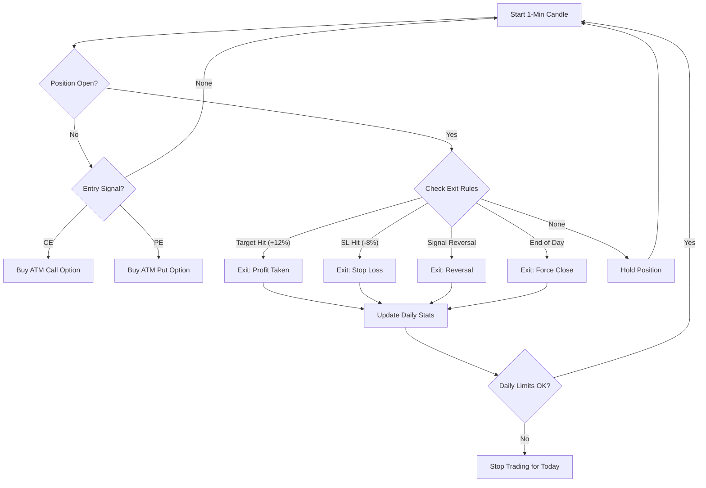

# Sensex 1‑Min Options Scalping Algo

Intraday scalping system for **ATM weekly Sensex options** on 1‑minute candles, with strict risk management, automated trade execution, and trade persistence.

### Features

- **Strategy**
  - 1‑min candles on Sensex spot.
  - Indicators: EMA9, EMA21.
  - Pullback‑based entries (bullish for CE / bearish for PE).
- **Risk**
  - Max trades/day, max consecutive losses.
  - Daily loss limit (% of capital) with **automatic position flattening**.
  - Per‑trade risk based position sizing.
  - Liquidity validation before entry.
- **Execution**
  - ATM strike selection (rounded to nearest 100).
  - Target +12% / SL −8% on option premium.
  - Opposite‑signal exits (EMA cross reversal).
  - End‑of‑day forced exit — no overnight positions.
  - Graceful shutdown with position flattening.
- **Broker Integration**
  - `KiteClientStub` — backtest/simulation using CSV data.
  - `KiteClientLive` — real Kite (Zerodha) trading via BFO exchange.
  - `KiteClientPaper` — **paper trading** with real market data and simulated orders.
- **Persistence & Recovery**
  - SQLite trade logging via `TradeLogger` — records all entries, exits, P&L, and exit reasons.
  - **Full State Recovery**: Resumes daily risk metrics (PnL, trade counts, consecutive losses) and active trade management seamlessly upon restart.

### Strategy Logic & Decision Flow

The system follows a strict rule-based approach for Sensex Options Scalping. Below is the detailed logic and a visual representation of how decisions are made.

#### 1. Market Analysis & Signal Generation

The system uses a **"Signal -> Confirmation -> Entry"** flow to ensure high-probability entries. It evaluates the following at the **close** of every 1-minute candle:

- **Bullish Entry (CE Trade)**:
  - **Context (Signal)**: EMA 9 is above EMA 21 (Bullish trend).
  - **Trigger (Pullback)**: The candle's Low touches or pierces EMA 9 (Low <= EMA 9 * 1.0005).
  - **Confirmation**: The candle **closes as Bullish** (Close > Open) and remains above EMA 9.
  - **Entry**: Market order is placed at the start of the **next** minute.

- **Bearish Entry (PE Trade)**:
  - **Context (Signal)**: EMA 9 is below EMA 21 (Bearish trend).
  - **Trigger (Pullback)**: The candle's High touches or pierces EMA 9 (High >= EMA 9 * 0.9995).
  - **Confirmation**: The candle **closes as Bearish** (Close < Open) and remains below EMA 9.
  - **Entry**: Market order is placed at the start of the **next** minute.

#### 2. Trade Lifecycle Flowchart



#### 3. Execution Scenarios

| Scenario | System Action | Rationale |
| :--- | :--- | :--- |
| **Entry Signal Detected** | Selects ATM Strike -> Validates Liquidity -> Places Market Order | Ensures entry is at the most liquid strike close to spot. |
| **Target Hit (+12%)** | Immediately places market exit order | Locks in profit as per strategy spec. No trailing. |
| **Stop Loss Hit (-8%)** | Immediately places market exit order | Protecs capital from deep drawdowns. |
| **EMA Cross Reversal** | Exits immediately (Market Order) | If EMA 9/21 cross in the opposite direction, the trend has changed. We exit regardless of P&L. |
| **Daily Loss Limit Reached** | Flattens all positions & stops for the day | Hard safety limit to prevent catastrophic daily losses. |
| **Liquidity Check Failure** | Skips the trade | Prevents entry into low-volume options with wide spreads (important for scalping). |
| **Restart Mid-Trade** | **Full Recovery**: Reloads trade data & resumes management | Ensures target/SL are still monitored even after a crash or restart. |

#### 4. Post-Target Logic (No Chasing)

One common question is: *What if the target is hit, but the market is still bullish?*

- **Strict Exits**: Once the +12% target is hit, the system exits immediately. It does **not** "stay in" to see if it goes higher.
- **No Chasing**: The system will **not** re-enter immediately just because the market is still bullish.
- **New Setup Required**: To take a second trade, the system must wait for a **fresh pullback**. 
  - The price must come back down to touch the EMA 9.
  - It must then confirm a fresh bullish bounce.
- **Daily Limits**: This cycle continues as long as the **Daily Loss Limit** or **Max Consecutive Losses** has not been reached.

#### 5. Risk Management & Safety (The Risk Engine)

The **Risk Engine** acts as the system's "Governor" or "Safety Switch." It works in real-time to protect your capital from market volatility and algorithmic errors.

- **State Resilience**: 
  - If the system restarts, the Risk Engine **doesn't forget**. It reloads your current PnL and loss count from the database to ensure that a restart cannot be used to bypass risk limits.

#### 6. Fail-Safe & Error Handling

Algorithmic trading requires resilience against technical glitches. The system includes several "internal safety nets":

- **The Pipeline Guard**: The main trading loop is wrapped in a high-level `try...except` block. If a single minute's data is corrupted or an indicator fails to calculate, the system logs the error and **skips that minute** rather than crashing.
- **Price Fallbacks**: If the system cannot fetch the exact "Last Traded Price" (LTP) of an option from the broker (due to API lag), it uses a calculated proxy based on the Sensex Spot price. This ensures that Target/SL monitoring **never stops** just because an API call failed.
- **Liquidity Lock**: Before entering any trade, the system performs a mandatory liquidity check. If the option has no volume or the data is missing, the trade is aborted to protect you from "slippage" (buying at a bad price).
- **Graceful Exit**: If you stop the program (Ctrl+C), the system catches the signal and attempts to generate your final report before shutting down, ensuring no data is lost.
- **Full Recovery**: If the entire computer crashes, you can simply restart the script. The system will look at `trades.db`, see that you had an open trade, and **immediately resume tracking it** with your original target and stop-loss.

- `back_test.py` – Entrypoint for backtest/stub loop.
- `paper_trade.py` – Entrypoint for paper trading (real data, simulated orders).
- `live_trade.py` – Entrypoint for live trading (real orders via Kite).
- `config.yaml` – All runtime configuration (account, risk, broker, windows).
- `core/` – Orchestration, config loading, and logging.
- `strategy/` – Signal generation, EMA indicators, and strike selection.
- `risk/` – Risk enforcement and position sizing.
- `execution/` – Trade lifecycle management and exit logic.
- `broker/` – Broker clients (Kite/ICICI) and WebSocket handlers.
- `database/` – SQLAlchemy models and the persistent `trades.db` store.
- `data/` – Historical CSV data and ICICI historical fetcher.
- `tools/` – Post-session reporting, token management, and helper scripts.
- `debug/` – Tick streaming and connectivity debug scripts.
- `tests/` – Suite for verifying strategy, risk limits, and state recovery.

### Setup

1. **Install dependencies**

   ```bash
   pip install -r requirements.txt
   ```

2. **Configure `config.yaml`**

   - Set `account.initial_capital`, `risk.*`, and `trade_params.*` as desired.
   - For live/paper trading with Kite:
     - Fill `broker.api_key` and `broker.access_token` (or use env vars).
     - Set `broker.ticker_tokens` to the Sensex instrument token for streaming.

3. **Environment variables** (recommended for credentials)

   ```bash
   export KITE_API_KEY="your_api_key"
   export KITE_ACCESS_TOKEN="your_access_token"
   ```

### Running

- **Backtest / Stub loop** (uses CSV data via `KiteClientStub`):

  ```bash
  python back_test.py
  ```

- **Paper trading** (real market data, simulated orders):

  ```bash
  python paper_trade.py
  ```

  Orders are logged with `[PAPER ORDER]` prefix. Trades are saved to `database/trades.db`.

- **Live trading** (real orders via Kite):

  ```bash
  python live_trade.py
  ```

  **⚠️ Warning:** Real orders will be placed. Ensure capital and risk settings are correct.

- **Reports** (generate summaries from `trades.db`):

  ```bash
  python tools/export_report.py [output_csv] [date YYYY-MM-DD or today]
  ```

### Tests

```bash
python -m pytest tests/ -v
```

### Deployment

To deploy the system to the production server:

1. Ensure you are on the `master` branch.
2. Run the deployment script with the desired mode (`live` or `paper`):
   ```bash
   # Deploy for live trading (default)
   ./scripts/deploy.sh live

   # Deploy for paper trading in the background
   ./scripts/deploy.sh paper
   ```

The script will sync the codebase to the production server using `rsync` and restart the process via `PM2`. 
- **Live Mode**: Uses PM2 name `sensex-scalper`.
- **Paper Mode**: Uses PM2 name `sensex-paper`.

> **⚠️ Warning:** Live trading involves real financial risk. Always paper trade first, verify option symbol formats against Kite's `instruments.csv`, and validate all logic before enabling real capital.
